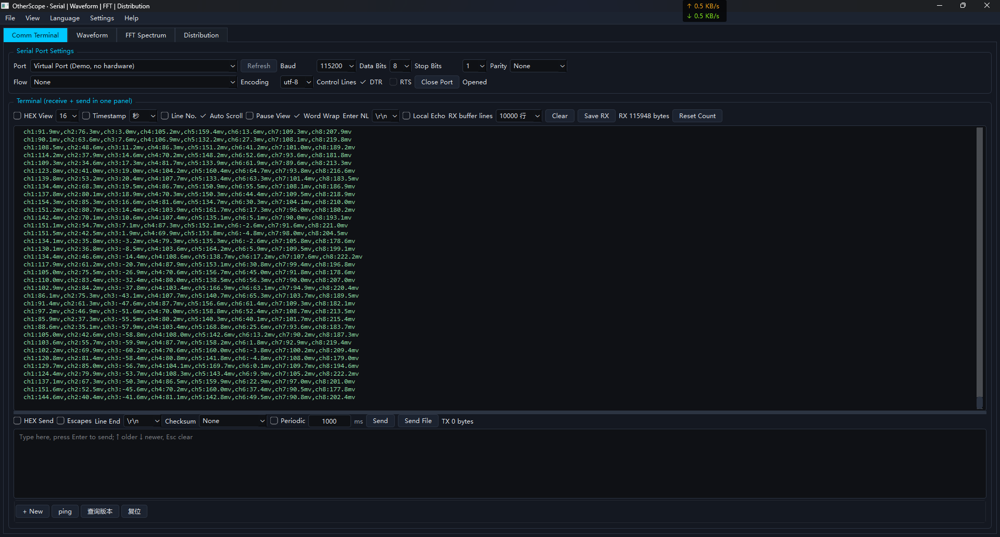
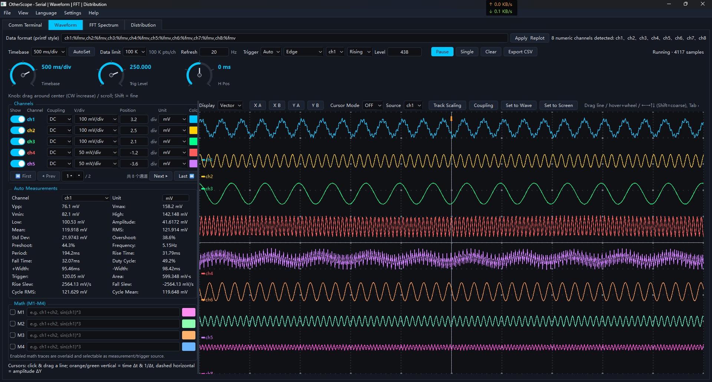
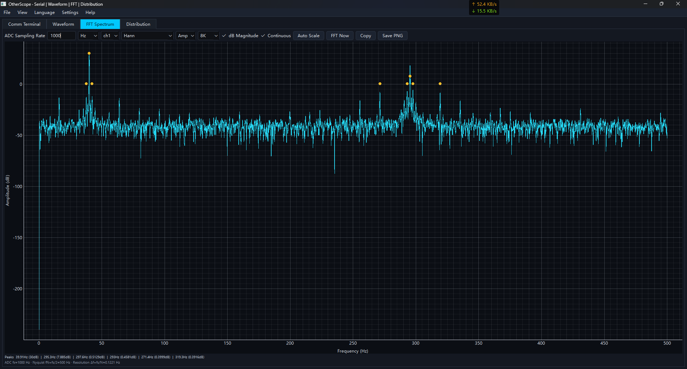
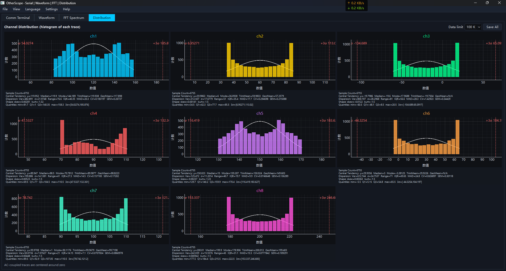

# OtherScope

**Read this in other languages: [English](README.md) | [简体中文](README.zh.md)**

> A professional multi-channel virtual oscilloscope for PC — acquire, analyze and visualize waveforms from serial / network streams with the look and feel of a real benchtop instrument.

[]()
[](https://www.python.org/)
[](https://doc.qt.io/qtforpython-6/)
[](https://www.pyqtgraph.org/)
[](LICENSE)
[](https://github.com/)
[]()

**OtherScope** turns your PC into a fully-fledged digital oscilloscope. Feed it raw samples from a serial port or TCP socket, and it renders up to **8 physical channels + 4 math channels**, with real-time measurements, FFT spectrum, distribution statistics, dual cursors, trigger logic and a clean dark/light UI — all in one self-contained file.

---

## ✨ Features

- **8 physical channels (ch1–ch8) + 4 math channels (M1–M4)** — arbitrary expressions such as `ch1+ch2`, `sin(ch1)*3`
- **Serial & network acquisition** — RS-232 over USB, TCP client/server, printf-style and raw/HEX framing
- **Auto format recognition** — one-click analysis of the most recent received lines infers the printf-style format string into the format box; then "Apply & Replot" renders the waveform
- **Real oscilloscope coupling** — DC/AC per channel, with AC implemented as a true coupling-capacitor high-pass (DC removal), matching the physics of a real scope
- **AutoSet** — one-click auto configuration of timebase, per-channel vertical gain/position and trigger (Keysight/Tektronix style channel-separated autoscale)
- **Trigger engine** — edge (rising/falling), pulse-width, runts, timeout & transition; 50% auto level
- **Math engine** — waveform arithmetic, `sin/cos/abs/sqrt/log/exp`, unit propagation with printf-format awareness
- **Automatic measurements** — 18+ parameters (Vpp, Vmax, Vmin, RMS, Mean, Frequency, Period, Rise/Fall, Duty, Area, Slew, …)
- **Dual cursors** — manual / track / auto modes, Δt · 1/Δt · ΔY readout, track-scaling and coupling follow
- **FFT spectrum** — window functions, dB scale, peak list, N-point control
- **Distribution panel** — histogram & level-distribution statistics
- **FIFO ring buffers** — every window updates from its own max-capacity FIFO for high-throughput streaming
- **i18n** — 中文 / English, hot-switchable at runtime
- **Dark & light themes** — instant switch
- **CSV export**, print-style data parsing, checksum/HEX terminal tools
- **One-file packaging** — Windows `.exe`, macOS `.app`, Linux ELF, all built by double-clicking a script in `build/`

---

## 📸 Screenshots

### Communication Terminal


### Waveform


### FFT Spectrum


### Distribution


---

## 🚀 Quick Start

### Option A — Single-file build (recommended)

| Platform | Action | Result |
|---|---|---|
| **Windows** | double-click `build\build_windows.bat` | `dist\OtherScope.exe` |
| **macOS** | double-click `build/build_macos.command` | `dist/OtherScope.app` |
| **Linux** | `./build/build_linux.sh` | `dist/OtherScope` |

The script auto-detects Python, installs every dependency (with mirror fallback),
fixes missing system Qt libraries, checks disk space, and produces a single
self-contained executable — **no manual steps needed**.

### Option B — Run from source

```bash
# 1. clone
git clone https://github.com/yourname/OtherScope.git && cd OtherScope

# 2. install dependencies
python -m pip install -r requirements.txt

# 3. run
python main.py
```

Or simply double-click `run_windows.bat` / `run_macos.command` / `run_linux.sh`.

> The packaged binary is also **self-healing**: on first launch it detects missing
> Qt system libraries, installs them automatically, restarts, and reports any
> anomaly in a pop-up — never fails silently.

---

## 🎛 Usage in 30 seconds

1. Connect your data source — serial port or TCP socket (see the **Comm Terminal** tab).
2. Set the data format, e.g. `ch1:%fmv,ch2:%fmv,...`.
3. Press **AutoSet** — the scope configures timebase, vertical scale and trigger by itself.
4. Watch live waveforms, measurements, FFT and distribution side by side.
5. Drag the cursors to read Δt / 1/Δt / ΔY; export CSV when you need the numbers.

For details see the built-in **Help → User Manual** (bilingual), or `docs/`.

---

## 🧩 Architecture

```
main.py                 entry point (+ self-bootstrapping)
OtherScope/
├── data_hub.py         central FIFO data bus (raw/DC/AC coupling)
├── oscilloscope.py     waveform panel, channel rows, trigger, AutoSet, cursors
├── fft_spectrum.py     FFT spectrum panel
├── communication_terminal.py  serial / network / terminal console
├── main_window.py      main window, menus, themes, i18n, quick-send bar
├── math_expression.py  math channel expression engine
├── printf_parser.py    printf-style frame parser (unit-aware)
├── cursor_measure.py   cursor & measurement engine (track / auto / manual)
├── data_*              measurement & statistics
└── translations.py     i18n dictionaries (zh/en)
```

Every display/operation/calculation/coupling shares **one unified framework**:
raw data comes in → DC data and AC data are derived → each window consumes its own
max-capacity **FIFO** — consistent, fast, low-coupling.

---

## 🧪 Testing

```bash
python -m pytest tests/ -q        # 117 tests, all passing
python -m pyflakes OtherScope/*.py main.py launcher.py bootstrap.py
```

An independent **40+-dimension, 290+-assertion offscreen audit** covers every
window/control across full lifecycles (language/theme cycles, trigger visibility,
channel toggling, data streaming, persistence, multi-tab coordination).

---

## 🤝 Contributing

Contributions are welcome! Please follow the **Huawei C/C++/Python Coding
Standard** (variable naming, comments, docstrings) so the codebase stays
consistent. Open an issue first for non-trivial changes.

1. Fork it
2. Create your feature branch (`git checkout -b feat/xxx`)
3. Commit your changes
4. Push to the branch
5. Open a Pull Request

---

## 📄 License

**Apache License 2.0** — free for personal and commercial use, modification,
and distribution. See [LICENSE](LICENSE) for the full text.

---

**Star it ⭐ if OtherScope saved you from dragging a real scope to your desk!**
