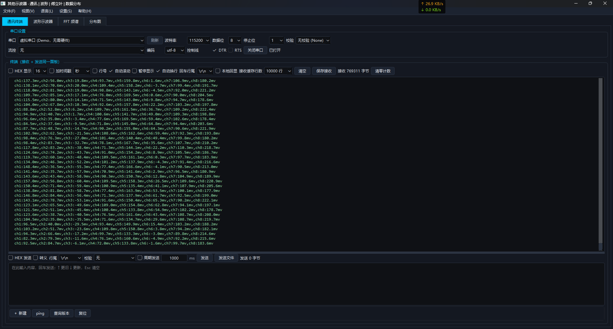
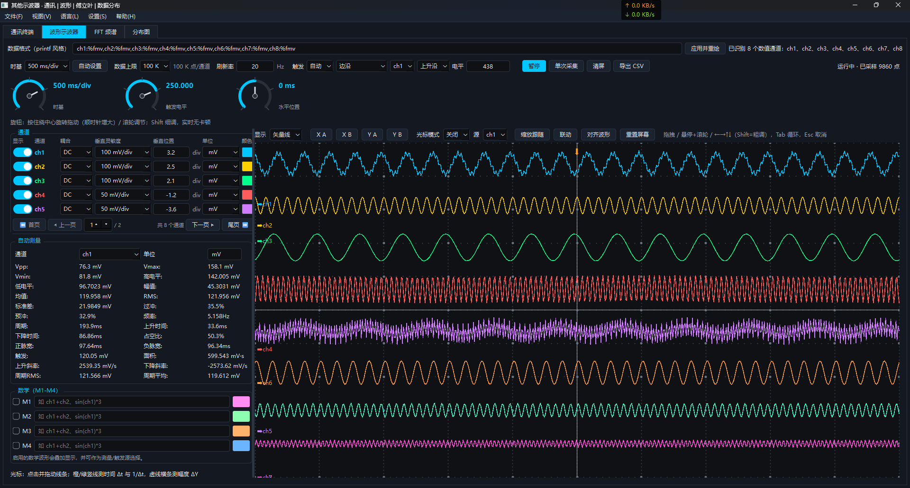
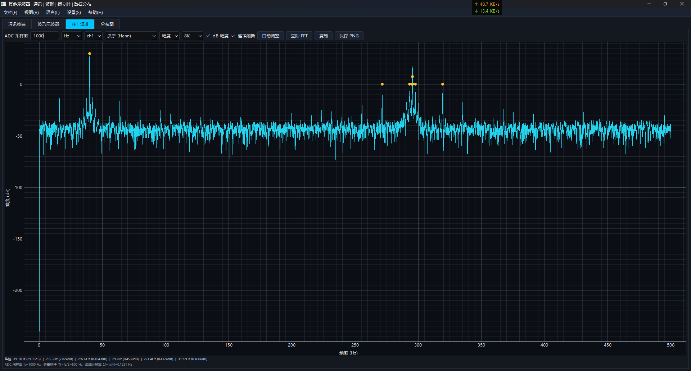
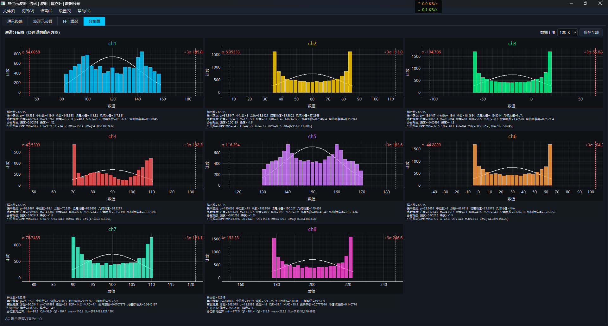

# OtherScope

**其他语言版本: [English](README.md) | [简体中文](README.zh.md)**

> 专业的 PC 端多通道虚拟示波器——通过串口 / 网络实时采集、分析与显示波形，还原真实台式示波器的操作体验。

[]()
[](https://www.python.org/)
[](https://doc.qt.io/qtforpython-6/)
[](https://www.pyqtgraph.org/)
[](LICENSE)
[](https://github.com/)
[]()

**OtherScope** 把你的电脑变成一台功能完整的数字示波器。从串口或 TCP 网络接收原始采样数据，
即可实时渲染 **8 路物理通道 + 4 路数学通道**，并提供实时测量、FFT 频谱、分布统计、
双光标、触发逻辑与清爽的深色 / 浅色界面——所有功能打包在**一个单文件**里。

---

## ✨ 功能特性

- **8 路物理通道（ch1–ch8）+ 4 路数学通道（M1–M4）**——支持任意表达式，如 `ch1+ch2`、`sin(ch1)*3`
- **串口与网络采集**——USB 转串口、TCP 客户端 / 服务端，支持 printf 风格与原始 / HEX 帧格式
- **数据格式自动识别**——一键分析通讯接口最近收到的数据行，自动推断 printf 风格格式串并写入格式框，再点击「应用并重绘」即可出波形
- **真实示波器耦合**——每通道 DC / AC 耦合；AC 耦合按真实"隔直耦合电容"物理实现（去除直流分量）
- **AutoSet 自动设置**——一键自动配置时基、各通道垂直档位 / 位置与触发（Keysight/Tektronix 风格通道分离自动缩放）
- **触发引擎**——边沿（上升 / 下降）、脉宽、毛刺、超时与转换触发；50% 自动触发电平
- **数学引擎**——波形四则运算、`sin/cos/abs/sqrt/log/exp`，结合 printf 格式自动传播单位
- **自动测量**——18+ 参数（峰峰值、最大值、最小值、有效值、均值、频率、周期、上升 / 下降时间、占空比、面积、压摆率等）
- **双光标测量**——手动 / 跟踪 / 自动模式，Δt · 1/Δt · ΔY 读数，跟踪缩放与耦合联动
- **FFT 频谱**——多种窗函数、dB 显示、峰值列表、点数控制
- **分布面板**——直方图与电平分布统计
- **FIFO 环形缓冲**——各窗口按自身缓存上限高效流式更新
- **国际化**——中文 / English 运行时一键切换
- **深色 / 浅色主题**——即时切换
- **CSV 导出**、printf 格式解析、校验和 / HEX 终端工具
- **单文件打包**——Windows `.exe`、macOS `.app`、Linux ELF，双击 `build/` 目录脚本即自动打包

---

## 📸 界面截图

### 通讯终端


### 波形示波器


### FFT 频谱


### 分布图


---

## 🚀 快速开始

### 方式一：单文件打包版（推荐）

| 平台 | 操作 | 产物 |
|---|---|---|
| **Windows** | 双击 `build\build_windows.bat` | `dist\OtherScope.exe` |
| **macOS** | 双击 `build/build_macos.command` | `dist/OtherScope.app` |
| **Linux** | 执行 `./build/build_linux.sh` | `dist/OtherScope` |

脚本自动检测 Python、安装全部依赖（含镜像源回退）、修复缺失的系统 Qt 运行库、
检查磁盘空间，最终生成**单个自包含可执行文件**——全程无需任何手动步骤。

### 方式二：源码运行

```bash
# 1. 克隆
git clone https://github.com/yourname/OtherScope.git && cd OtherScope

# 2. 安装依赖
python -m pip install -r requirements.txt

# 3. 运行
python main.py
```

也可以直接双击 `run_windows.bat` / `run_macos.command` / `run_linux.sh`。

> 打包后的程序具备**自愈能力**：首次启动自动检测缺失的 Qt 系统库，自动安装并重启，
> 任何异常都以弹窗明确提示，绝不静默失败。

---

## 🎛 30 秒上手

1. 连接数据源——串口或 TCP 网络（见 **通讯终端** 标签页）。
2. 设置数据格式，例如 `ch1:%fmv,ch2:%fmv,...`。
3. 点击 **AutoSet 自动设置**——示波器自动配置时基、垂直档位与触发。
4. 同步查看实时波形、测量、FFT 与分布。
5. 拖动光标读取 Δt / 1/Δt / ΔY；需要数据时可导出 CSV。

详细说明见程序内 **帮助 → 使用手册**（中英双语）或 `docs/`。

---

## 🧩 架构说明

```
main.py                 程序入口（含自举启动）
OtherScope/
├── data_hub.py         中央 FIFO 数据总线（原始 / DC / AC 耦合）
├── oscilloscope.py     波形面板、通道行、触发、AutoSet、光标
├── fft_spectrum.py     FFT 频谱面板
├── communication_terminal.py  串口 / 网络 / 终端控制台
├── main_window.py      主窗口、菜单、主题、国际化、快捷发送栏
├── math_expression.py  数学通道表达式引擎
├── printf_parser.py    printf 风格帧解析（自动识别单位）
├── cursor_measure.py   光标与测量引擎（跟踪 / 自动 / 手动）
├── data_*              测量与统计
└── translations.py     国际化字典（中 / 英）
```

所有波形显示、操作、计算与耦合共用**同一套框架**：原始数据进入 → 派生 DC 数据与
AC 数据 → 各窗口消费各自缓存上限的 **FIFO**——一致、高效、低耦合。

---

## 🧪 测试

```bash
python -m pytest tests/ -q        # 117 个用例全部通过
python -m pyflakes OtherScope/*.py main.py launcher.py bootstrap.py
```

另有独立的 **40+ 维度、290+ 断言的无界面（offscreen）审计**，覆盖每个窗口 / 控件的
完整生命周期（语言 / 主题切换周期、触发参数显隐、通道启停、数据流、持久化、多标签协同）。

---

## 🤝 贡献指南

欢迎贡献！请遵循**华为编码规范**（变量命名、注释、docstring），保持代码风格一致。
较大改动请先提 issue 讨论。

1. Fork 本项目
2. 创建特性分支（`git checkout -b feat/xxx`）
3. 提交改动
4. 推送分支
5. 发起 Pull Request

---

## 📄 License

**Apache License 2.0**——允许个人与商业使用、修改与分发。完整文本见 [LICENSE](LICENSE)。

---

**如果 OtherScope 让你免去把示波器搬上办公桌的麻烦，请点亮 ⭐ Star！**
